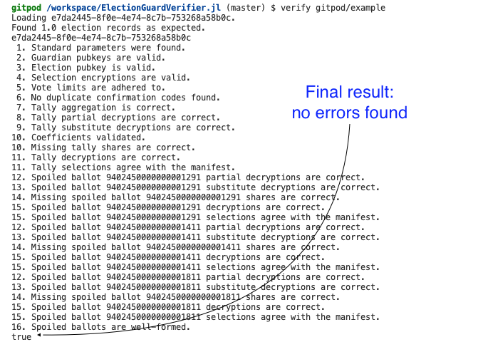

# Results

The `check` function implements what is described in the version 1.1
[ElectionGuard
Specification](https://github.com/microsoft/electionguard/releases/tag/v1.1/EG_spec_v1.1.pdf).
To understand the output of the MITRE ElectionGuard Verifier, please
turn to Section 5.2 titled "Verifier Steps".  The numbers in the
output correspond to the steps listed in this section.  For example,
the line of output that says:

```
1. Standard parameters were found.
```

is the result of performing the check described in Step 1.

The verifier implements all verification steps with the following
exceptions:

 * Step 3B where the spec says Qbar = H(Q, K) but what was implemented
   is Qbar = H(Q, commitment hash).

 * Step 6A on checking confirmation codes is not implemented because
   the specification does not describe the check with enough detail.

 * Step 6B on duplicate confirmation detection checks submitted
   ballots only.

 * Steps 17, 18, and 19 cannot be implemented because it relies on
   data that is not presently part of an election record.

 * Steps 16C, D, and E are printed as 15C, D, and E so to as make
   better reuse of code.

The output provides additional information when a verification step
fails.  Many verification steps specify an enumeration of checks, each
labeled by a capital letter.  When a step fails, the letters
associated with failed checks are listed after the step number.  So an
output line that starts with

```
9CD. Bla bla...
```

means the check associated with items 9.C and 9.D failed.  Many checks
inspect more than one record.  If say Item C only fails on one record,
and Item D only fails on another, both Items will be reported.

When more than one record fails during a check, the comment associated
with the failures is non-deterministically picked from one of the
failures.

### Sample Output



## Verification Record as JSON

When the `check` method is called with an addition string, the string
names the path of an output file used to store the verification record
in JSON format.  The record has the following form.

- `spec_version` [string] ElectionGuard specification version

- `election_scope_id` [string] Election identifier

- `start_date` [ISO date time as string] Start time of election

- `end_date` [ISO date time as string] End time of election

- `verifier` [string] Name of verifier

- `run_date` [UTC ISO date time as string] Verifier run time

- `verified` [boolean] Did election record verify?

- `answers` [list of answer] Verification results

Each answer has the following form.

- `step` [int] Verification step number

- `items` [string] Verification items in a step that failed ('X' is
  used when the step has no enumerated items.)

- `section` [string] Step section title

- `comment` [string] Result comment

- `count` [int] Number of records checked

- `failed` [int] Number of checks that failed

### Example

```
{
  "spec_version": "v0.95",
  "election_scope_id": "jefferson-county-primary",
  "start_date": "2020-03-01T08:00:00-05:00",
  "end_date": "2020-03-01T20:00:00-05:00",
  "verifier": "MITRE ElectionGuard Verifier",
  "run_date": "2022-05-27T20:54:14.689",
  "verified": false,
  "answers": [
    {
      "step": 1,
      "items": "",
      "section": "Parameter verification",
      "comment": "Standard parameters were found.",
      "count": 1,
      "failed": 0
    },
    {
      "step": 2,
      "items": "",
      "section": "Guardian public-key validation",
      "comment": "Guardian pubkeys are valid.",
      "count": 5,
      "failed": 0
    },
    {
      "step": 3,
      "items": "B",
      "section": "Election public-key validation",
      "comment": "Election pubkey is invalid.",
      "count": 1,
      "failed": 1
    },
    ...
  ]
}
```

## Election Record Loading Failures

If the MITRE ElectionGuard Verifier receives an election record that
is not well formed, the program prints

```
Error loading the election record at PATH
```

where PATH is the location of the election record loaded.  It then
prints a stack trace for experience Julia programmers that identifies
the cause of the loading failure.
